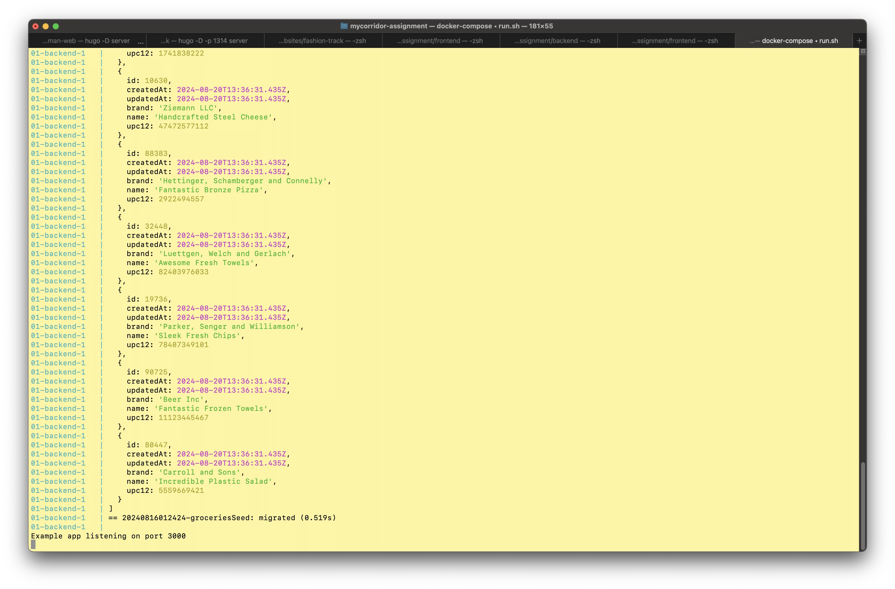
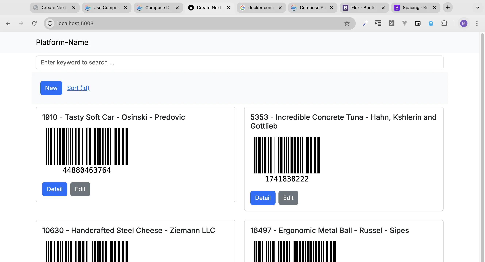
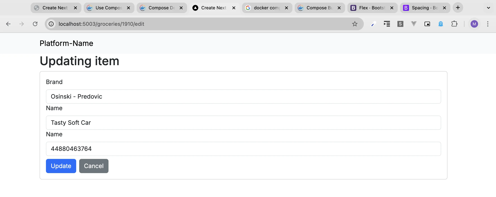

# BC Assignment

this is for Big Corridor Assignment. It's has two parts, backend and frontend. The backend runs [Express](https://expressjs.com/) which connects to a MySQL instance via [Sequelize](https://sequelize.org/). The front end is [Next.JS](https://sequelize.org/), a framework for [React] which is stylized by [react package](https://react-bootstrap.netlify.app/) of [Bootstrap](https://getbootstrap.com/)

## How to Run

* You will need to [install Docker](https://docs.docker.com/engine/install/) on your machine. The whole thing runs 3 instance of docker (for the fronend, backend and MySQL)
* Clone this repo on your machine.
* create .env file and use the default values
```
MYSQLDB_USER=root
MYSQLDB_ROOT_PASSWORD=123456
MYSQLDB_DATABASE=bc_assignment
MYSQLDB_LOCAL_PORT=5002
MYSQLDB_DOCKER_PORT=3306

NODE_LOCAL_PORT=5001
NODE_DOCKER_PORT=3000

NEXTJS_LOCAL_PORT=5003
NEXTJS_DOCKER_PORT=3000
```
* To run the demo, you just execute the run script

```
./run.sh
```

* The script will launch docker, rebuild the database, seed data, install the js packages on the backend and frontend and uses port 5003 for the frontend. Port 5001 and 5002 will be used for backend and database respectively.
* When it's running, the frontend should be accessible via [http://localhost:5003/](http://localhost:5003)
* You can quit the demo by sending a kill signal (`ctrl + c`) in the terminal

## Sample Pics


After running `./run.sh`, this is what the terminal should look like when the app is ready. 


Main page of the app


When you editing one of the item, this is the page.